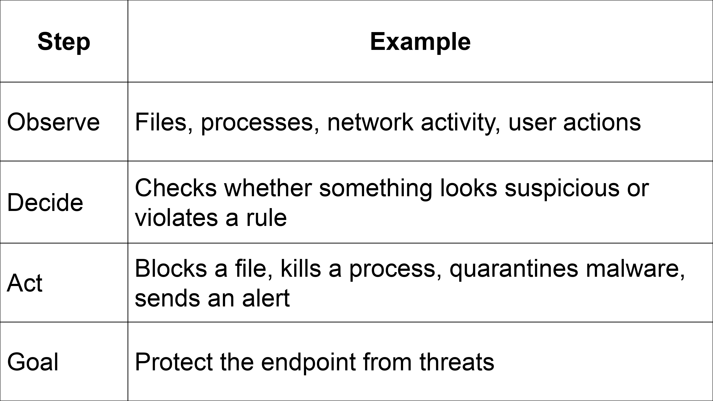
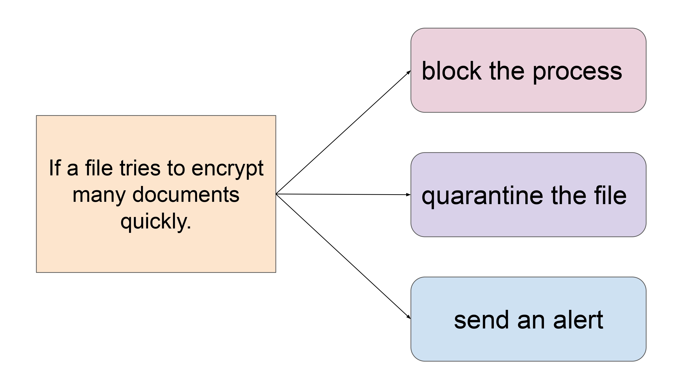
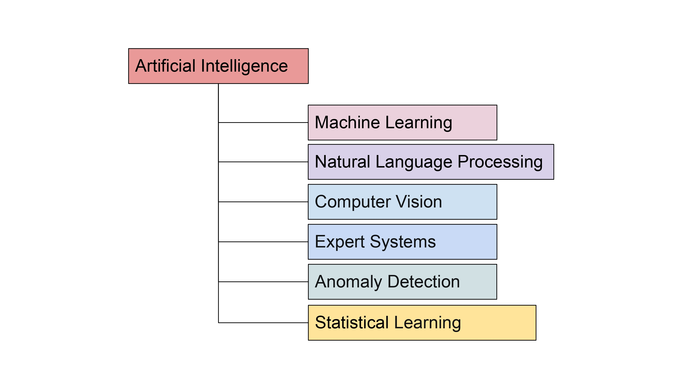
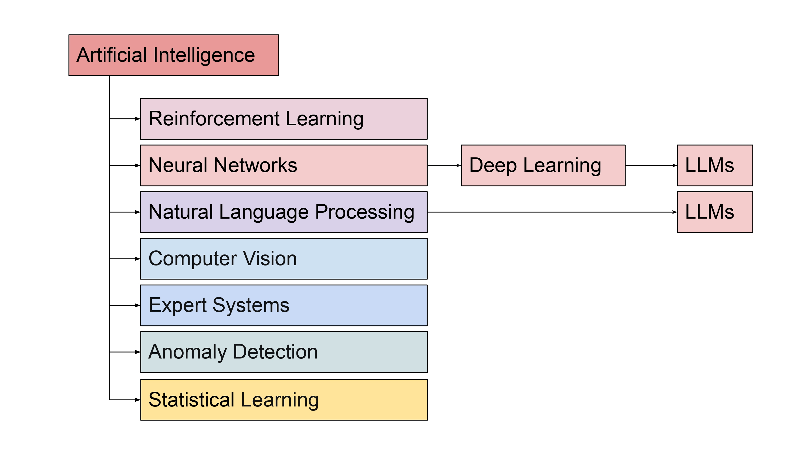
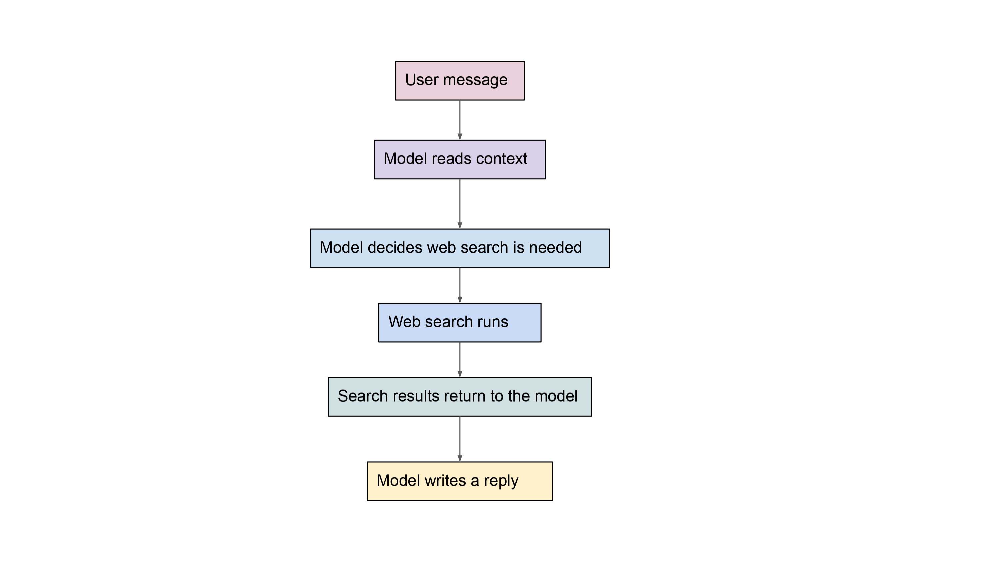
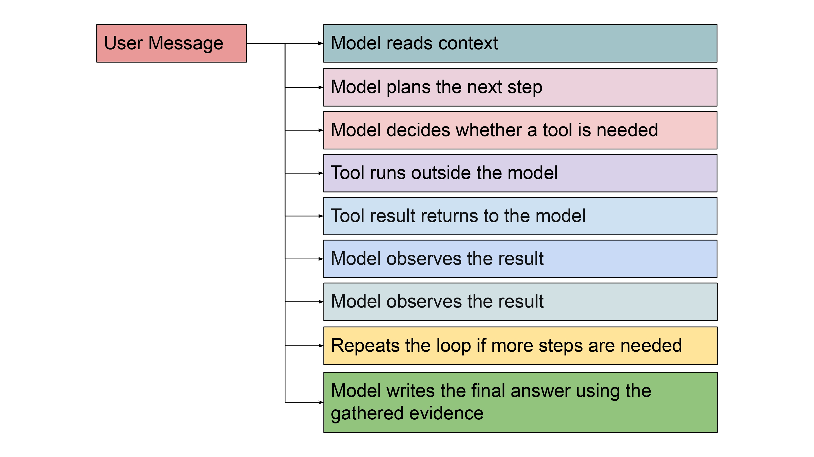
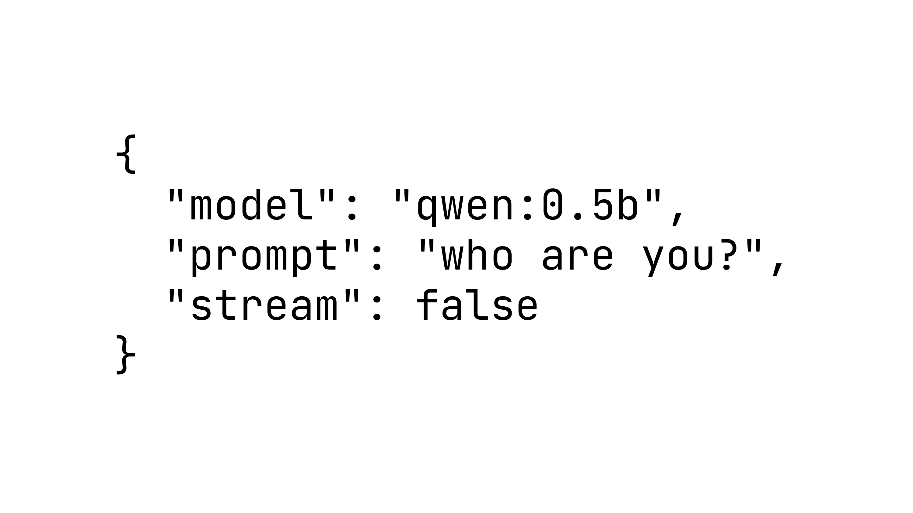
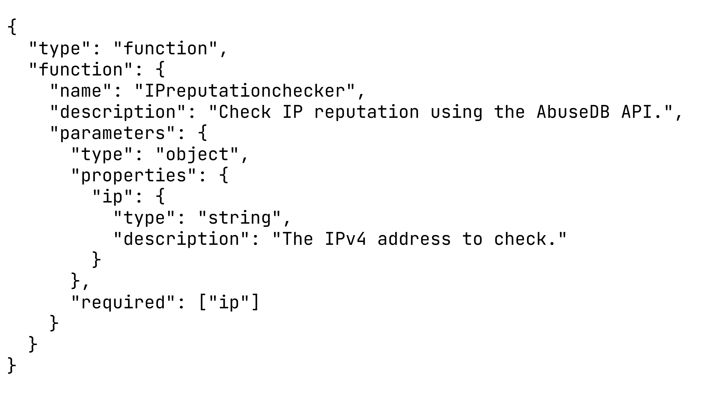

# Introduction

Artificial Intelligence, or **AI**, is changing the way many industries work, and cybersecurity is no exception. Security teams deal with large amounts of information every day: alerts, logs, IP addresses, user activity, incident notes, and threat intelligence. A lot of this work is not only about spotting whether something is malicious. It is also about understanding what happened, deciding what should be checked next, and explaining the result clearly.

This is why security teams are starting to explore how certain types of **AI**, especially **Large Language Models (LLMs)**, can support alert triage, investigation, and decision-making.

We will explain LLMs in more detail later, but you may have already used one through tools like ChatGPT, Claude, or Gemini.

### Model vs LLM

Before we continue, keep this distinction in mind because both terms appear throughout the room:

- **Model** is the broad term for any trained AI or ML system. A model could be used for many things, such as classification, anomaly detection, scoring, image recognition, or text generation.
- **LLM**, or **Large Language Model**, is a specific type of model trained to understand and generate language. Qwen, ChatGPT, Claude, and Gemini are examples of LLMs.
- An LLM can also have different versions. For example, ChatGPT has had versions such as GPT-3.5 and GPT-4, and Qwen has versions such as Qwen2.5. These are still LLMs, but they may have different capabilities, speed, accuracy, or tool-calling support.
- **Ollama** is a tool that lets us run models locally on our own machine. In this room, Ollama acts as the local service that runs the LLM for our agent.

In this room, we use **model** when discussing model names, parameters, size, or the API field called `model`. We use **LLM** when discussing language understanding, reasoning, generation, tool requests, or the agent's reasoning step.

In simple terms:

**Python** -> **Ollama** -> **LLM** -> **Response**

In short: every LLM is a model, but not every model is an LLM. Ollama is not the LLM itself; it is the tool we use to run the LLM locally.

This room focuses on building a small **LLM-powered SOC triage agent**. We will also briefly compare it with other AI-powered agents so the terminology stays clear.

We will build an AI agent that can read Microsoft Entra ID alert logs from `alert.json`, use a simple **ReAct planning loop** to let the LLM reason and request actions, call an IP reputation tool when needed, feed the tool result back to the LLM, and receive a final triage summary.

### Learning Prerequisites

Before starting this room, you should be comfortable with:

- Basic Python scripting, including variables, functions, dictionaries, lists, and reading files.
- Basic API concepts, such as HTTP requests, request bodies, response data, and JSON parsing.
- Using common command-line tools such as `curl` and `jq`.

### Learning Objectives

By the end of this room, you should be able to:

- Explain the difference between an agent, an AI-powered agent, and an LLM-powered agent.
- Send requests to a local LLM through the Ollama API using `curl`.
- Compare how different LLM sizes can affect SOC alert analysis.
- Understand Tool Calling, Tool Defination, ReAct Loop.
- Build a simple ReAct loop that lets the LLM reason, request an IP reputation check, observe the result, and produce a final SOC triage summary.

# What is an Agent?

Before we define an AI agent, we need to define an agent.

In simple terms, an **agent** is a tool that can: **observe -> decide -> act** to achieve a **goal**.

The **decision** part in an agent can be simple deterministic code, fixed rules, logic, machine learning, or another method.

### Endpoint Security Example

To make this concrete, think about an endpoint security agent. It observes activity on a machine, decides whether something looks suspicious, and acts by alerting, blocking, or quarantining.

 Figure 1.1: Observe, Decide, Act, Goal Explanation.

### Rule-Based Decisions

Many traditional endpoint agents make decisions using **predefined rules** created by security engineers. Below is one such rule.

 Figure 1.2: An Endpoint Agent's Rule.

Rules work well when the activity matches a known pattern. The limitation is that attackers can change their behavior to avoid a specific rule. For example, if a rule expects many files to be encrypted quickly, malware might encrypt fewer files, pause between actions, or spread the activity over time.

Security engineers can add more rules and correlate more signals, but it becomes difficult to manually define every possible suspicious pattern. This is where AI can help the agent make a more flexible decision.

We will see how AI can help us in such cases in the coming sections.

::question
What three steps describe how an agent works?
answer: observe decide act
::

::question
What can help an agent make more flexible decisions?
answer: AI
::

# What is an AI Agent?

Many people use the term AI-powered agent or **AI agent** to mean an LLM-powered system that uses an LLM to **reason**, make **decisions**, and use tools such as a CLI, API, search engine, or code interpreter to complete a **goal**. That is a common modern usage, but it is not the full meaning.

An AI-powered agent, or AI agent, is any agent that uses AI in its decision-making. It does not always mean an **LLM-powered agent**.

AI-powered agents can include:
- specialized AI/ML-powered agents (anomaly detection, classification, scoring, and similar tasks)
- reinforcement learning agents
- LLM-powered agents

### What AI Means

But before we go further, what is an **AI**?

AI means Artificial Intelligence.

In simple terms, AI is the ability of computer systems to perform tasks that typically require human intelligence, such as reasoning, recognizing patterns, making predictions, understanding language, detecting unusual behavior, planning, or making decisions.

AI is not one single technology. It is a broad field made up of multiple areas and techniques.

### Room Terminology

Before we move forward, have a look at the terminology we will use for the rest of the room.

AI-powered agent:
- Broad category for any agent that uses AI in its decision-making.
- Could be a specialized AI/ML-powered agent or an LLM-powered agent.

Specialized AI/ML-powered agent:
- An agent that uses a narrower AI or ML model for a specific task, such as anomaly detection, classification, scoring, or NLP.

LLM-powered agent:
- A specific kind of AI-powered agent that uses a Large Language Model for language understanding, reasoning, planning, or tool selection.
- Examples include ChatGPT, Gemini, Grok, Claude, and Llama (Meta AI).

Just for this room, when we say **specialized AI/ML-powered agent**, we mean a non-LLM AI system built around a narrow task, such as anomaly detection, classification, scoring, or NLP extraction. In real life, the definition can be broader. But in this room, we use **specialized AI/ML-powered agent** to refer to traditional AI/ML tools that are designed for one specific job, instead of a general-purpose LLM-based agent.

When we say **LLM-powered agent**, we mean an AI-powered agent that uses an LLM for reasoning, language understanding, and tool selection.

So, **AI-powered agent** is the broad category. An LLM-powered agent is one type of AI-powered agent.

### AI Fields and LLMs

Below are some of the major fields of AI.

 Figure 1.3: Major fields of AI.

These fields can also have subfields.

 Figure 1.4: Subfields of AI.

As you can see, **AI** and **LLM** are not separate ideas. An LLM falls inside two AI subfields: Natural Language Processing and Deep Learning / Neural Networks.


::question
What does LLM stand for?
answer: Large Language Model
::

::question
An LLM falls inside Natural Language Processing and what other AI subfield?
answer: Deep Learning
::

# From Rule-Based Agents to AI-Powered Agents

Now that the confusion around AI agents is clearer, we can come back to rule-based agents.

A traditional rule-based agent works like this:

**Observe -> Decide (fixed rules) -> Act**

A specialized AI/ML-powered agent works more like this:

**Observe -> Decide (AI/ML) -> Act**

The agent still observes the environment and takes action, but the **decide** part becomes more data-driven. Instead of only asking **"did this exact rule trigger?"**, a specialized AI/ML-powered agent can ask **"does this behavior look unusual based on the signals I have?"**

A specialized AI/ML-powered agent will use anomaly detection, classification, or risk scoring to decide whether something is likely safe, suspicious, or malicious. This does not mean AI removes rules completely. In real systems, AI is usually combined with rules, policies, signatures, and human analysis. The important point for this room is simple: AI can make the decision step more flexible than fixed rules alone.

### Security Engineering Context

Now let us connect this to security engineering.

Security engineering is not just about detecting whether something is malicious or safe. It is also about understanding **what happened**, **why it happened**, **how serious it is**, **what systems are affected**, and **what should be done next**.

A security engineer or analyst may need to work with many different sources of information, such as:

- Endpoint Alerts
- Network Logs
- SIEM Events
- Cloud Logs
- Identity Logs
- Threat Intelligence Reports
- Other relevant security data sources

This means security work is not only a classification problem. It is also a **reasoning problem**.

### Why Reasoning Matters

For example, a **specialized AI/ML agent** may answer: "This file is likely malicious" or "This behavior has a high risk score."

That is useful, but it is not always enough.

A security team may also need to know:

- Why is it malicious?
- What evidence supports this decision?
- Is this part of a larger attack?
- Which other systems should be checked?
- What logs should be investigated next?
- What action should be taken?
- How should this be explained in an incident report?

Specialized AI/ML models are useful, but they are usually designed for narrower tasks such as classification, anomaly detection, or scoring. They do not usually explain decisions clearly, read long security reports, connect information from different tools, or plan multi-step investigations in a flexible way.

This is the gap where **Large Language Models**, or **LLMs**, become important.

::question
What part of the agent becomes more data-driven in a specialized AI/ML-powered agent?
answer: decide
::

::question
Security work is not only a classification problem. It is also what type of problem?
answer: Reasoning
::

# From AI-Powered Specialized Agents to LLM-Powered Agents

### What Is an LLM?

Before we continue, what is an LLM?

An **LLM**, or **Large Language Model**, is a type of AI model trained to understand and generate human language. Think ChatGPT, Claude, Google Gemini, DeepSeek, and similar tools.

Because an LLM is part of AI, an **LLM-powered agent** is one type of **AI-powered agent** as well.

### How LLMs Help Security Work

LLMs are useful in security because a lot of security work involves language and context, such as alerts, logs, investigation notes, reports, and threat intelligence. They can help with:

- Understanding Context
- Summarizing Information
- Reasoning Over Evidence
- Planning Investigation Steps
- Generating Reports
- Explaining Decisions

But an LLM by itself is mostly a **thinking and language system**. It can read input and write a useful response, but it does not automatically check live tools, query security systems, or take action in an environment.

### Why Build Agents Around LLMs?

A normal LLM may be able to answer: "This alert looks suspicious because the process modified many files and connected to an unusual domain."

But a security engineer may need the system to do more than explain. They may need it to:

- Look up Threat Intelligence
- Query SIEM logs
- Check related alerts
- Recommend containment actions
- Create an incident ticket
- Perform similar security workflow tasks.

That is why we build **agents around LLMs**. The LLM becomes the reasoning part, and the agent turns that reasoning into action by connecting it to tools, planning, and feedback from tool results.

### LLM Chatbot vs AI Agent (LLM-Powered)

You might ask: we already have LLMs that are smart and intelligent, so why are we building agents on top of LLMs?

That is true. Modern AI chatbots like ChatGPT and Claude can already reason, answer questions, and even use tools. But a chatbot is usually designed to respond to a single user request, while an agent is designed to take actions, use tools, inspect results, and continue reasoning until the task is complete.

An agent does not just generate an answer. It can decide what step to take next, call tools, inspect the results, update its reasoning, and continue until it reaches a useful outcome.

A normal AI chatbot usually follows this pattern:

 Figure 1.5: Normal AI Chatbot Pattern.

An LLM-powered agent follows a richer pattern:

 Figure 1.6: LLM-powered Agent Pattern.

### Comparison

So far, we can compare the ideas like this:

| System | Basic pattern |
| ------ | ------------- |
| Rule-based agent | observe -> decide using fixed rules -> act |
| Specialized AI/ML-powered agent | observe -> decide using a narrow AI/ML model -> act |
| LLM | receive input -> reason over context -> optionally use tools -> generate text |
| LLM-powered agent | observe -> reason with an LLM -> plan next step -> use tools when needed -> observe tool results -> update context -> repeat if needed -> answer or recommend action |

::question
An agent is designed to take actions, inspect results, and, most importantly, use what?
answer: Tool
::

# Sending Your First API Request

In this task, you will send your first API request to an LLM. The lab provides two LLMs:

- qwen:0.5b
- qwen2.5:1.5b

The **B** in a model name refers to parameters. In this case, **B = billions**, meaning billions of parameters.

A parameter is a learned value inside a model that helps it make predictions; very small LLMs can have millions of parameters, while frontier-scale LLMs can have hundreds of billions or even trillions. For this room, you do not have to go deep into parameters and size.

**Qwen:0.5b** has 0.5B parameters and is smaller than **Qwen2.5:1.5b**, which has 1.5B parameters.

Larger LLMs often perform better on reasoning and analysis tasks, but they also require more compute. For this room, you do not need to study model architecture in detail. The important point is that you will compare a smaller LLM with a larger LLM and observe how their responses differ.

From this point onward, this task will refer to "qwen:0.5b" as **Qwen** and "qwen2.5:1.5b" as **Qwen2.5**.

### Basic Request Pattern

Before building an agent, we will start with the simplest LLM interaction:

**Prompt** -> **LLM** -> **Response**

You will query the **/api/generate** endpoint. This endpoint accepts a JSON body containing the model name, the prompt, and whether the response should be streamed:

 Figure 1.7: JSON body.

### Streaming Responses

The "stream" field controls how the answer is returned. When "stream" is set to "true", the API returns multiple JSON objects as the LLM generates its answer. Each object contains part of the response. When "stream" is set to "false", the API returns one complete JSON object after generation finishes.

For example, send the following request with "stream" set to "true":

```bash
curl -s http://localhost:11434/api/generate \
  -d '{
    "model": "qwen:0.5b",
    "prompt": "who are you?",
    "stream": true
  }' \
| jq
```

The output will be returned in chunks. Once you get the output, you will notice that each object contains only part of the response. The final object has `"done": true`, which indicates that the LLM has finished generating.

For the rest of this task, set "stream" to "false". This produces a single JSON response, which is easier to read and easier to use in scripts.

### Sending the First API Call to the LLM

Ask **Qwen** an identity question:

```bash
curl -s http://localhost:11434/api/generate \
  -d '{
    "model": "qwen:0.5b",
    "prompt": "who are you?",
    "stream": false
  }' \
| jq
```

Now ask the same question to **Qwen2.5** by changing only the `model` value:

```bash
curl -s http://localhost:11434/api/generate \
  -d '{
    "model": "qwen2.5:1.5b",
    "prompt": "who are you?",
    "stream": false
  }' \
| jq
```

The API response contains several fields, such as `model`, `created_at`, `response`, `done`, `context`, and timing information. For now, the most important field is `response`.

To print only the LLM's answer, append `| jq -r '.response'` to the command:

```bash
curl -s http://localhost:11434/api/generate \
  -d '{
    "model": "qwen2.5:1.5b",
    "prompt": "who are you?",
    "stream": false
  }' \
| jq -r '.response'
```

This is useful when building scripts or agents, because the program often needs the LLM's answer rather than the full API metadata.

### Analyze SOC Alert Data

Next, ask both LLMs to analyze the same SOC alert data. The file `alert.json` contains Microsoft Entra ID logs. You may review the file before sending it to the LLM. The `alert.json` file is in the `labs` directory.

```bash
cd labs
cat alert.json | jq
```

Start with **Qwen**:

```bash
curl http://localhost:11434/api/generate \
  -H "Content-Type: application/json" \
  -d "$(
    jq -n \
      --rawfile alert alert.json \
      '{
        model: "qwen:0.5b",
        prompt: (
          "You are a SOC Triage Assistant. Analyze this alert:\n\n"
          + $alert +
          "\n\nOutput JSON with exactly these sections: Log Id, Severity Guess, Meaning, Suggested Next Step."
        ),
        stream: false
      }'
  )" \
| jq -r '.response'
```

In the request above, `-d "$( ... )"` sends JSON data as the request body, `--rawfile alert alert.json` loads `alert.json` into the variable `$alert` as text, and `prompt: (...)` sends the prompt to the LLM.

Now run the same task with **Qwen2.5**:

```bash
curl http://localhost:11434/api/generate \
  -H "Content-Type: application/json" \
  -d "$(
    jq -n \
      --rawfile alert alert.json \
      '{
        model: "qwen2.5:1.5b",
        prompt: (
          "You are a SOC Triage Assistant. Analyze this alert:\n\n"
          + $alert +
          "\n\nOutput JSON with exactly these sections: Log Id, Severity Guess, Meaning, Suggested Next Step."
        ),
        stream: false
      }'
  )" \
| jq -r '.response'
```

### Compare LLM Outputs

Compare the two outputs. **Qwen** classifies the logs as low or informational, while **Qwen2.5** identifies more serious events, including critical, high, and medium severity alerts.

In particular, Qwen:0.5B misses the suspicious sequence involving:

- entra-log-0003
- entra-log-0004
- entra-log-0005
- entra-log-0006

Qwen2.5 handles those events better because it has stronger reasoning capability. This is one reason the selected model matters for LLM tasks: smaller LLMs are easier to run, but they may miss context or underestimate risk.

Now that you have called the API with `curl`, the next step is to move the same idea into a Python script. This is useful because agents are usually programs, not one-off terminal commands. A script can read files, build prompts, call the LLM service, parse the response, and later add tools.

::question
How many chunks were returned when `stream` was set to `true`? (Enter the Number)
answer: 12
::

::question
How many alerts were marked as High Severity by Qwen2.5? (Enter the Number)
answer: 2
::

# Building the AI SOC Triage Agent - Part 1

In the previous section, you sent `alert.json` to the LLM with `curl`. Now we will move that same idea into Python.

This is the baseline script for our SOC triage agent. It is **not a full agent yet** because it does not use tools or loop over tool results. For now, it will do one simple workflow:

**alert.json** -> **soc_script.py** -> **LLM API** -> **triage summary**

The script will:

1. Read the alert file.
2. Send the alert content to the LLM (Qwen2.5).
3. Print the LLM's triage summary.

Later, we will build on top of this script and add tool calling.

### Writing the Code

Select `soc_script.py` in the code editor.

The imports are already done for you:

```python
import json
import sys
import urllib.request
```

These imports give the script the basic pieces it needs:

- `json` converts Python data into JSON and reads JSON responses.
- `sys` reads the alert filename from the terminal command.
- `urllib.request` sends the request to the LLM.

The starter file has two main parts:

- `call_ollama(alert_content)` will build and send the API request.
- `alert_data = f.read()` reads `alert.json`; then the code calls `call_ollama()` and prints the result.

We will fill in the missing pieces one step at a time.

### Step 1: Fill In the URL and Model

First, the script needs to know where the LLM is running and which model to use.

Add the chat URL and model we will use.

```python
OLLAMA_CHAT_URL = "http://localhost:11434/api/chat"
OLLAMA_MODEL = "qwen2.5:1.5b"
```

Now the script knows the LLM API endpoint and the model name.

### Step 2: Add the Triage Instruction

Next, we need to tell the LLM what job it should do. We do this with prompts.

Prompts are useful because they give the LLM a clear role, task, and output format. Since we want the LLM to behave like a SOC triage assistant, analyze the alert data, and return a structured JSON summary, we will use a prompt that makes the agent's response predictable and to the point.

Inside `call_ollama()`, find the empty `system_prompt` value:

```python
def call_ollama(alert_content):
    system_prompt = 
```

This is where we will add our prompt.

```text 
"You are a SOC Triage Assistant. Analyze the provided JSON alert. Return a clear triage summary in JSON format with these fields: Log Id, Severity Guess, Meaning, Suggested Next Step."
```

This prompt gives the LLM a role and tells it what format to return. In the next step, we will combine this prompt with the actual alert content.


### Step 3: Complete the Payload

Now the script has:

- the LLM API URL,
- the model name,
- the triage instruction.

The next step is to put the model name, instruction, and alert content into the request body. This request body is called the **payload**.

Find the two `<FILL-IT>` values in the payload and replace them like this:

```python
    payload = {
        "model": OLLAMA_MODEL,
        "messages": [
            {
                "role": "user",
                "content": system_prompt + "\n\n" + alert_content,
            }
        ],
        "stream": False,
    }
```

`"model": OLLAMA_MODEL` tells the model we want to use.

`"content": system_prompt + "\n\n" + alert_content` joins the triage instruction and the alert file content into one message for the LLM.

`"stream": False` tells the LLM to return one complete answer instead of many small chunks, just like you tested earlier.

### Step 4: Prepare the Web Request

The payload is ready, but Python still needs to turn it into an HTTP request and send the request to `OLLAMA_CHAT_URL`, which is the LLM's API endpoint. We can do this using the HTTP request object `urllib.request.Request()`.

Find the comment `# STEP 4: Prepare the web request` and add this code under it:

```python
    req = urllib.request.Request(
        OLLAMA_CHAT_URL,
        data=json.dumps(payload).encode("utf-8"),
        headers={"Content-Type": "application/json"},
    )
```

This prepares the request for the LLM:

- `OLLAMA_CHAT_URL` is where the request will be sent.
- `json.dumps(payload)` converts the Python dictionary into JSON text.
- `.encode("utf-8")` converts that JSON text into bytes for the request body.
- `headers={"Content-Type": "application/json"}` tells the LLM that the request body is JSON.

At this point, the script has built the request, but it has not sent it yet.

### Step 5: Send the Request and Read the Response

Now let's write the code that sends the request to the LLM and reads the response.

Find the comment `# STEP 5: Send the request and read the response` and add this code under it.

Add:

```python
    with urllib.request.urlopen(req) as response:
        result = json.loads(response.read().decode("utf-8"))
        return result["message"]["content"]
```

This does four things:

1. sends the request with `urlopen(req)`,
2. reads the response body,
3. converts the JSON response into a Python dictionary,
4. returns only the LLM's answer from `result["message"]["content"]`.

Now `call_ollama()` is complete.

### Step 6: Read the Alert File and Call the LLM

The function is ready, so now we can connect it to the alert file.

At the bottom of the script, this code is already reading the filename from the terminal command:

```python
file_path = sys.argv[1]
```

If you run the script like this:

```bash
python3 soc_script.py alert.json
```

then `sys.argv[1]` is `alert.json`.

The script then opens that file and stores its contents in `alert_data`:

```python
with open(file_path, "r", encoding="utf-8") as f:
    alert_data = f.read()
```

The last missing piece is to pass `alert_data` into `call_ollama()`.

Find:

```python
summary = call_ollama(<FILL-IT>)
print(summary)
```

Fill it in:

```python
summary = call_ollama(alert_data)
print(summary)
```

Now the full flow is connected:

**read alert.json** -> **send it to the LLM** -> **receive the triage summary** -> **print it**

Run the script:

```bash
cd labs
python3 soc_script.py alert.json
```

You should see a SOC triage summary in the terminal. The LLM should analyze the alert, estimate the severity, explain what the alert probably means, and suggest a next step for the analyst.

This script is still a one-shot LLM script: it sends the alert and receives one answer. In the next section, we will build on top of this by adding tool calling, so the LLM can ask Python to check extra information before giving the final triage summary.

# Where the LLM Falls Short

You might ask: if the script `soc_script.py` is already working and summarizing the `alert.json` file correctly, why do we need to add `tool calling`? Also, what exactly is this `tool calling` thing?

We will explain that in a few minutes, but to answer that question: everything worked well, the LLM estimated the severity, explained the alert, and suggested next steps. However, the LLM (Qwen2.5) still misses one important detail. It marks `entra-log-0012` as Low severity.

### The Missing Context

Open `alert.json` and inspect `entra-log-0012`. Find the IP address used by `sam.rivera@contoso.example`.

```bash
cd labs
cat alert.json
```

Once you have noted the IP address, send a request to the AbuseDB endpoint.

```bash
curl -sG "http://localhost:8080/api/v2/check" \
  --data-urlencode "ipAddress=185.249.74.198" \
  --data-urlencode "maxAgeInDays=90" \
  --data-urlencode "verbose=true" \
  -H "Key: 4f9c2a7d8e1b3c6f0a5d9e2c7b1a8f3d6c4e9b2a1f0d7c8e6b3a9d5f2c1e7a4" \
  -H "Accept: application/json" | jq
```

Based on the output, you should notice that the IP address `185.249.74.198` has a high abuse confidence score and reports related to suspicious authentication activity. Qwen2.5 did not know this external reputation information when it analyzed the alert file, so it treated the login as low severity.

This demonstrates the limitation of using an LLM by itself. An LLM can reason over the text you provide, but it cannot automatically access outside information.

### The Bridge to Tool Calling

Since we are already passing the `alert.json` data to the LLM, why not also pass the IP reputation result to the LLM?

Instead of making the LLM guess based only on `alert.json`, we can ask the LLM to request an IP reputation check when it sees an IP address. Then our Python code runs the AbuseDB API call, gets the result, and sends that result back to the LLM.

Now the LLM no longer has to decide severity using only the alert file. It can also use the AbuseDB result, such as the high abuse confidence score, to understand that the login may be more serious than it first appeared and give us a more confident summary.

This is the idea behind **Tool Calling**, and we will explore it in the next section.

::question
What is the `abuseConfidenceScore` for the IP 185.249.74.198 reported by AbuseDB? (Enter the Number)
answer: 92
::

# Tool Calling

**Tool Calling** is a technique where Large Language Models (LLMs) ask the program or script to run a specific tool when they need extra information or an action performed.

Put another way: **tool calling** is a technique where a program or script tells the LLM what tools are available. Since the LLM cannot run the tool by itself, it requests the tool when it needs extra information. The script or program then runs the tool and sends the result back to the LLM.

Think of it like this:

- **Python**: Hey LLM, I have a tool called `IPreputationchecker`. Use it if you need to check an IP address.

- **LLM**: OK, I found an IP address that may be suspicious. I need to find more information about it. Please run `IPreputationchecker` with `ip` = 185.249.74.198.

- **Python**: OK, the LLM wants me to run the `IPreputationchecker` tool. Since `IPreputationchecker` is connected to the AbuseDB API, Python sends a request to the AbuseDB `/api/v2/check` endpoint with the IP address 185.249.74.198. AbuseDB returns the IP reputation result. Python sends that result back to the LLM.

- **LLM**: I use the AbuseDB API result to write a better triage summary.

This is how combining the LLM's reasoning with external tool data improves the script and turns it from a basic script into an AI agent.

### Tool Definition

Before the LLM can request a tool, we need to tell the LLM what tools are available. The LLM does not automatically know about our Python functions or local APIs. We must describe the tool ourselves and send that description to the LLM in the request.

This description is called a **tool definition**.

A tool definition is like a small instruction card. It tells the LLM:

- This tool exists.
- This is what the tool does.
- This is the input the tool needs.

Based on this instruction card, the LLM decides when a tool is useful and which tool to request. This is especially important when there are multiple tools available. **If the tool definition is unclear or incorrect, the LLM may choose the wrong tool, provide the wrong input, or not request the tool at all.** So the tool name, description, and parameters should be clear and specific.

In our case, we want the LLM to know about a single IP reputation tool. The tool definition would look like this:

 Figure 1.8: The Tool Definition.

The important parts are:

| Field            | Value                                      | Description                                                                                                                           |
| ---------------- | ------------------------------------------ | ------------------------------------------------------------------------------------------------------------------------------------- |
| type             | function                                   | Tells the LLM that the tool is a function-style tool.                                                                                 |
| name             | IPreputationchecker                        | The tool name the LLM must use when calling the tool. The Python code later checks this name and runs the matching Python function.   |
| description      | Check IP reputation using the AbuseDB API. | Explains when the tool should be used. In this case, the tool is used when the LLM needs reputation data for an IP address.           |
| parameters       | parameters object                          | Defines the input parameters required by the tool.                                                                                    |
| ip               | 185.249.74.198                             | Input field the LLM must provide as the IP address.                                                                                   |
| type (inside ip) | string                                     | Indicates that the IP address should be provided as text.                                                                             |
| required         | [ip]                                       | Ensures the LLM does not call the tool without providing an IP address.                                                               |


In simple terms, this JSON says: There is a tool called IPreputationchecker. Use it when you need to check an IP address. When you request it, provide one value called `ip`.

At this point, nothing has been executed yet. The JSON is only the tool description. The LLM has only been told that the tool exists. It will be executed only if the LLM requests this tool. Then Python will read the tool name and run the matching API function (the real tool).

As mentioned, the real tool still needs to be implemented in Python. Python will have a function that sends the IP address requested by the LLM to the AbuseDB `/api/v2/check` endpoint and gets the reputation result back.

::question
What is the name of the tool registered in the tool definition?
answer: IPreputationchecker
::

# Test Tool Calling With Curl

In this section, we will use `curl` to test whether `qwen2.5:1.5b` supports tool calling and can return a `tool_calls` request.

Normally, the Python script will send the tool definition to the LLM. Before writing that Python code, we will do the same thing manually with `curl`.

**Run the curl request below.**

```bash
curl -s http://localhost:11434/api/chat \
  -H "Content-Type: application/json" \
  -d '{
    "model": "qwen2.5:1.5b",
    "messages": [
      {
        "role": "user",
        "content": "Check reputation for IP 185.249.74.198"
      }
    ],
    "tools": [
      {
        "type": "function",
        "function": {
          "name": "IPreputationchecker",
          "description": "Check IP reputation using the AbuseDB API.",
          "parameters": {
            "type": "object",
            "properties": {
              "ip": {
                "type": "string",
                "description": "The IPv4 address to check."
              }
            },
            "required": ["ip"]
          }
        }
      }
    ],
    "stream": false
  }' | jq
```

From the output, you will see the LLM return a `tool_calls` field. This means the LLM is not giving the final answer yet. It is asking our program to run `IPreputationchecker` with `ip` = 185.249.74.198.

This confirms that the LLM understands the tool definition and can request the tool correctly.

Not all LLMs support tool calling. You can test this by running the same request with `"model": "qwen:0.5b"`.

So far, we confirmed that `qwen2.5:1.5b` can request a tool call.

The next step is to write a Python script that sends the tool definition to the LLM, reads the `tool_calls` response, and then calls the AbuseDB API when the LLM requests `IPreputationchecker`.

But there is one more important question: **How does Python know when the LLM wants to use a tool?**

### How Loops Come Into Play

The answer is that Python must check the LLM's response. If the response contains a `tool_calls` field, Python knows the LLM is asking for a tool. Python then reads the tool name and arguments, runs the matching API call, and sends the tool result back to the LLM.

This creates a loop:

- Ask the LLM to analyze the alert.
- Check if the LLM requested a tool.
- If it did, run the tool.
- Send the tool result back to the LLM.
- Ask the LLM again.
- Repeat until the LLM gives a final answer.

This kind of loop is often called a **ReAct loop**, which means the agent can reason, take an action, observe the result, and then continue reasoning.

In the coming section, we will build this loop in Python.

::question
Which model in the lab has tool-calling support? (Do not include the parameter)
answer: qwen2.5
::

# ReAct

A loop gives the agent a way to decide what to do next instead of trying to answer everything in one step.

### Why Do We Need a Loop?

When designing LLM-powered AI agents, the first LLM response might not be the final answer. The LLM might first say, **I need to check this IP address.** In that case, Python must run the tool, send the result back, and ask the LLM again.

Without a loop, the script would stop too early and print only the tool request instead of the final SOC triage summary.

There are different ways to design agent loops, such as **Plan-and-Execute**, **Reflection**, **Router**, and **ReAct**. In this room, we will use **ReAct** because it is simple and works well for tool calling.

ReAct means: **REason** + **ACT**

### ReAct Loop for Our Use Case

For our SOC triage agent, the ReAct loop would look like this:

- Reason: The LLM reads the alert and notices an IP address.
- Act: The LLM requests the IPreputationchecker tool.
- Observe: Python runs the AbuseDB API and sends the result back.
- Reason again: The LLM uses the AbuseDB score to write a better final summary.

The LLM decides whether to request a tool by reading:

1. The user's request
2. The alert data
3. The tool definition

The tool definition tells the LLM:

- There is a tool named IPreputationchecker.
- It checks IP reputation.
- It needs an IP address.

So if the LLM sees an IP address in the alert and decides reputation data would help, it can return a `tool_calls` field instead of a final answer.

For example, the LLM may reason like this:

- I see IP address 185.249.74.198.
- I do not know if this IP is malicious.
- There is a tool that can check IP reputation.
- I should request that tool.

If the LLM does not need a tool, it returns normal text in `content`. If it needs a tool, it returns `tool_calls`.

So the final workflow becomes:

1. Python sends `alert.json` and the tool definition to the LLM.
2. The LLM either gives a final answer or requests a tool.
3. If the LLM requests a tool, Python runs the matching tool.
4. Python sends the tool result back to the LLM.
5. The LLM uses the tool result to produce the final answer.

Now we will build this ReAct loop in Python step by step.

::question
What does ReAct stand for? (Do not include the plus sign)
answer: Reason Act
::

# Building the AI SOC Triage Agent - Part 2

In this section, we will finish `fullagent.py`.

The earlier script sent the alert to the LLM and received one answer. This new script does a little more:

1. Send the alert to the LLM
2. The LLM asks for an IP reputation tool if needed
3. Python runs the AbuseDB API call
4. Python sends the tool result back to the LLM
5. The LLM writes the final triage summary

You do not need to write the whole script from scratch. The starter file already contains the imports, API URLs, and most of the helper code. We will paste the missing pieces one step at a time and explain what each piece does.

### Step 1: The Imports

At the top, you should see these imports:

```python
import json
import sys
import urllib.parse
import urllib.request
```

These are used for:

- `json` to convert Python dictionaries to JSON and read JSON responses.
- `sys` to read the filename from the terminal command.
- `urllib.parse` to build URL query parameters for the AbuseDB API.
- `urllib.request` to send HTTP requests to the LLM and AbuseDB.

We will use `qwen2.5:1.5b` because we already confirmed that it can return `tool_calls`.

### Step 2: Add the Tool Definition

Find the empty tool variable:

```python
TOOL =
```

Add the tool definition.

```python
TOOL = {
    "type": "function",
    "function": {
        "name": "IPreputationchecker",
        "description": "Check IP reputation using the AbuseDB API.",
        "parameters": {
            "type": "object",
            "properties": {
                "ip": {
                    "type": "string",
                    "description": "The IPv4 address to check.",
                }
            },
            "required": ["ip"],
        },
    },
}
```

We just added the tool definition. Now the LLM is aware that the `IPreputationchecker` tool exists.

In plain English, this tool definition says:

- There is a tool called `IPreputationchecker`.
- Use it to check IP reputation.
- When you request it, provide an input called `ip`.

Later, if the LLM sees an IP address and wants more context, the LLM can request this tool by returning a `tool_calls` field.

### Step 3: Check How the Tool Is Sent to the LLM

The `call_ollama()` function is already mostly complete in the starter file, you just need to add the payload.

Find the empty payload in the `call_ollama()` function and add the payload that we need to send to the LLM.

```python
def call_ollama(messages):
    """Sends the conversation history (and tools) to the AI."""
    payload = {
        "model": OLLAMA_MODEL,
        "messages": messages,
        "tools": [TOOL],
        "stream": False,
    }
```

The important line to note is:

```python
"tools": [TOOL],
```

This sends the tool definition from Step 2 to the LLM.

Think of `call_ollama()` as the function that says:

- Here is the conversation so far.
- Here are the tools you can request.
- Tell me what to do next.

The LLM can now respond in one of two ways:

- normal `content`, which means it is giving a final answer
- `tool_calls`, which means it wants Python to run a tool first

### Step 4: Add the SOC Triage Prompt

Now we need a way to tell the LLM how it should behave. We do that with a prompt. The prompt tells the LLM what role to play and what format to return. In our case, we want the LLM to act like a SOC triage assistant and return the summary in JSON format.

Returning JSON is useful because it gives the output a clear structure. Instead of getting random paragraphs, Python can work with fields like `Log Id`, `Severity Guess`, `Meaning`, and `Suggested Next Step`.

Let's add the prompt. Find the start of `run_react_loop()`:

```python
def run_react_loop(alert_content):
    system_prompt =
```

Replace the empty string in the system_prompt with this prompt:

```text
"You are a SOC Triage Assistant. Analyze the provided JSON alert and output a triage summary in JSON format with exactly these four sections for each alert: 1. Log Id 2. Severity Guess: (e.g., Low, Medium, High, Critical) 3. Meaning: (What the alert probably indicates) 4. Suggested Next Step: (What the analyst should do next)"
```

The next part of the function creates the first message we will send to the LLM:

```python
    messages = [
        {
            "role": "user",
            "content": system_prompt + "\n\n" + alert_content,
        }
    ]
```

The `messages` list is the conversation history we send to the LLM. This first message contains two things:

```text
system_prompt:
    The instruction that tells the LLM how to behave.

alert_content:
    The actual contents of alert.json.
```

This line combines both parts:

```python
"content": system_prompt + "\n\n" + alert_content
```

So the LLM receives one message that means:

- **Here is your job:** Act like a SOC triage assistant and return a structured summary.
- **Here is the data:** The contents of alert.json.

The `\n\n` adds a blank line between the instruction and the alert data, making the message easier for the LLM to separate and understand.

The LLM now receives both the task (prompt) and the `alert.json` data in the same message.

# Building the AI SOC Triage Agent - Part 3

So far, we have given the LLM a SOC triage prompt, sent it the alert data, and told it about one tool named `IPreputationchecker`. Now we need to add the ReAct loop to make the agent reason over the alert, act by requesting a tool when it needs more information, observe the tool result, and then answer with a better triage summary.

We will build this section in the following order:

**Reason** -> **Act** -> **Observe** -> **Answer**

Let's build `Reason -> Act -> Observe -> Answer` step by step.

### Step 1: Reason

The first part of the loop asks the LLM to reason over the current conversation.

Paste this directly after the `messages` list inside `run_react_loop()`:

```python
    while True:
        print("[*] Asking AI to analyze the data...")
        result = call_ollama(messages)
        assistant_message = result["message"]
```

Let's understand what the code does.

In simple terms, it starts the **ReAct** loop.

The line below sends the current `messages` list to the LLM:

```python
result = call_ollama(messages)
```

At the beginning, `messages` contains:

1. The SOC triage prompt
2. The contents of alert.json
3. The tool definition sent through `call_ollama()`

The LLM reads that information and decides what to do next. This is the **Reason** step.

The LLM can respond in two ways:

- it can return normal text in `content`
- it can return `tool_calls` if it wants Python to run a tool

This line stores the LLM's reply:

```python
assistant_message = result["message"]
```

We need to inspect this message before we know whether the agent should act or answer.

### Step 2: Decide Whether to Act or Answer

Next, Python checks whether the LLM requested a tool.

Paste this under the code from Step 1:

```python
        tool_calls = assistant_message.get("tool_calls", [])

        if not tool_calls:
            print("[*] AI returned final answer.")
            return assistant_message["content"]
```

To explain the code, we are looking for `tool_calls` and we are doing it via:

```python
tool_calls = assistant_message.get("tool_calls", [])
```

When we tested tool calling with `curl`, the LLM returned a response like this:

```json
"tool_calls": [
  {
    "function": {
      "name": "IPreputationchecker",
      "arguments": {
        "ip": "185.249.74.198"
      }
    }
  }
]
```

This is the same field we are checking for.

The `.get("tool_calls", [])` part means: Try to get `tool_calls` from the assistant message. If it does not exist, use an empty list.

An empty list means the LLM did not request a tool. If there are no tool calls, the ReAct loop is finished:

```python
if not tool_calls:
    print("[*] AI returned final answer.")
    return assistant_message["content"]
```

This is the **Answer** path. The LLM has enough information and gives the final triage summary.

If `tool_calls` is not empty, the script continues into the **Act** path.

### Step 3: Act

If the LLM requested a tool, Python needs to run it.

Paste this under the code from Step 2:

```python
        print(f"[*] AI requested {len(tool_calls)} tool call(s).")
        
        messages.append(assistant_message)

        for tool_call in tool_calls:
            tool_name = tool_call["function"]["name"]
            
            arguments = tool_call["function"]["arguments"]
            ip = arguments.get("ip", {}).get("value") if isinstance(arguments.get("ip"), dict) else arguments.get("ip")

            print(f"[*] Running Tool: {tool_name} on IP: {ip}")
            
            tool_result = call_abusedb(ip)
```

Let's break it down.

First, Python saves the assistant's tool request into the conversation:

```python
messages.append(assistant_message)
```

This keeps the conversation history complete:

- **Python**: Analyze this alert.
- **LLM**: I need to call IPreputationchecker for 185.249.74.198.

Then Python loops through the requested tool calls:

```python
for tool_call in tool_calls:
```

Even if there is only one tool call, it is still stored inside a list. That is why we use a `for` loop.

Next, Python reads the tool name (in our case it is `IPreputationchecker`):

```python
tool_name = tool_call["function"]["name"]
```

Then Python reads the arguments:

```python
arguments = tool_call["function"]["arguments"]
ip = arguments.get("ip", {}).get("value") if isinstance(arguments.get("ip"), dict) else arguments.get("ip")
```

The argument we care about is the IP address. In simple terms, this line checks two possible formats:

- Sometimes the IP is stored directly like `"ip": "1.2.3.4"`
- Other times it is stored inside an object like `"ip": {"value": "1.2.3.4"}`

This makes the script work correctly with both formats.

Finally, Python runs the AbuseDB helper function `call_abusedb()`, which calls the AbuseDB API:

```python
tool_result = call_abusedb(ip)
```

This is the **Act** step. The LLM requested the tool, and in response, Python performs the actual API call by calling the `call_abusedb()` function, sending the IP address the LLM asked about to the AbuseDB API, and returning the JSON result. Python does not send the JSON result to the LLM yet; we will do that next.

The `call_abusedb()` function is already implemented in the code. You do not need to do anything.

### Step 4: Observe

Now Python has the tool result, but the LLM has not seen it yet. The JSON result must be sent back to the LLM.

Paste this under the code from Step 3:

```python
            messages.append(
                {
                    "role": "tool",
                    "name": tool_name,
                    "content": json.dumps(tool_result),
                }
            )
```

This is the **Observe** step.

The message has `"role": "tool"`.

This tells the LLM that this message is the output from the tool it requested.

The AbuseDB API originally returns JSON data, but inside Python, `call_abusedb()` has already parsed that response into a Python dictionary. Before we put the result into the LLM message, we convert the dictionary back into JSON text:

```python
"content": json.dumps(tool_result)
```

Now the conversation history looks like this:

1. Python sends a request to the LLM with the SOC prompt and `alert.json`
2. LLM requests IPreputationchecker
3. Python adds a tool message containing the AbuseDB result

After this, the `while True` loop goes back to the top. The agent asks the LLM again, but this time the LLM can see the AbuseDB result.

### Step 5: Answer

Before we implemented the tool call, the LLM only had the alert data. After the tool call implementation, the LLM now has IP reputation data as well. This is the key difference between the basic script and the agent.

For example, the LLM can now see that `185.249.74.198` has a high abuse confidence score. That should make `entra-log-0012` higher risk than the earlier one-shot summary suggested.

When the LLM no longer needs another tool, it returns normal `content` instead of `tool_calls`.

That is the final **Answer** step.

The full ReAct loop inside `run_react_loop()` should now look like this:

```python
    while True:
        print("[*] Asking AI to analyze the data...")
        result = call_ollama(messages)
        assistant_message = result["message"]
        
        tool_calls = assistant_message.get("tool_calls", [])

        if not tool_calls:
            print("[*] AI returned final answer.")
            return assistant_message["content"]

        print(f"[*] AI requested {len(tool_calls)} tool call(s).")
        
        messages.append(assistant_message)

        for tool_call in tool_calls:
            tool_name = tool_call["function"]["name"]
            
            arguments = tool_call["function"]["arguments"]
            ip = arguments.get("ip", {}).get("value") if isinstance(arguments.get("ip"), dict) else arguments.get("ip")

            print(f"[*] Running Tool: {tool_name} on IP: {ip}")
            
            tool_result = call_abusedb(ip)
            
            messages.append(
                {
                    "role": "tool",
                    "name": tool_name,
                    "content": json.dumps(tool_result),
                }
            )
```

### Step 6: Run the Full Agent

Run:

```bash
cd labs
python3 fullagent.py alert.json
```

You should see messages similar to:

```text
[*] Asking AI to analyze the data...
[*] AI requested 1 tool call(s).
[*] Running Tool: IPreputationchecker on IP: 185.249.74.198
[*] Asking AI to analyze the data...
[*] AI returned final answer.
```

Notice that now `entra-log-0012` should be treated as higher risk because the IP reputation score is high.

The agent is now doing the full flow:

```text
Reason:
    The LLM reads the alert and decides whether it needs more evidence.

Act:
    Python runs the IPreputationchecker tool requested by the LLM.

Observe:
    Python sends the AbuseDB result back to the LLM as a tool message.

Answer:
    The LLM writes a final triage summary using both the alert and the tool result.
```


You can add something like this after **Step 6: Run the Full Agent**:

# Wrapping up

What you've built here is the foundation of how many modern AI agents work today:

**Reason** -> **Use Tools** -> **Observe Results** -> **Continue Reasoning** -> **Answer**

The core idea is simple: An LLM reasons over context, requests tools when needed, receives external information, and continues working until it reaches a useful outcome.

Modern AI agents are now evolving beyond simple tool calling. Recent developments have introduced concepts such as Skills, Memory, MCP, A2A etc. making ake agents significantly more powerful by letting agents maintain long-term context, coordinate with other agents, access many external systems, and perform more autonomous workflows.

However, these improvements also introduce new security risks and attack surfaces like **Prompt Injection**, **Poisoned Tool Reponses**,  **A2A Exploitation**, **Data leakage through context windows** and even **Supply chain risks from third-party MCP servers**.

As AI agents become more autonomous and connected to real systems, securely building and deploying them becomes increasingly important. Security engineers must think carefully about trust boundaries, validation, access control, logging, sandboxing, and how much autonomy an agent should have.
